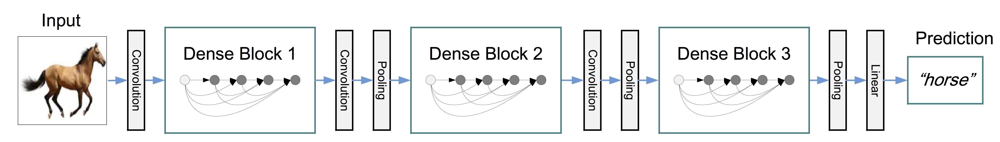
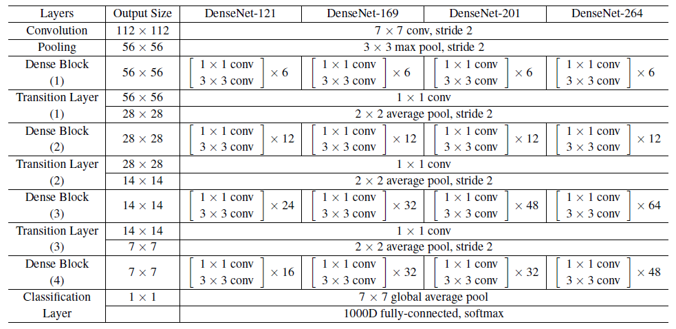

# DenseNet
 
DenseNet is a network architecture where each layer is directly connected to every other layer in a feed-forward fashion (within each dense block). For each layer, the feature maps of all preceding layers are treated as separate inputs whereas its own feature maps are passed on as inputs to all subsequent layers. This connectivity pattern yields state-of-the-art accuracies on CIFAR10/100 (with or without data augmentation) and SVHN. On the large scale ILSVRC 2012 (ImageNet) dataset, DenseNet achieves a similar accuracy as ResNet, but using less than half the amount of parameters and roughly half the number of FLOPs.

Figure 1: A dense block with 5 layers and growth rate 4.

Figure 2: A deep DenseNet with three dense blocks.

DenseNet architecture for ImageNet

    pip install -r requirements.txt

Run [scratch.ipynb ](https://github.com/FreckledMe/DenseNet/blob/main/scratch.ipynb)
